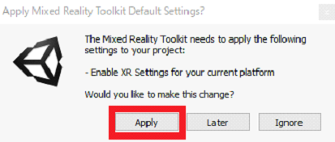
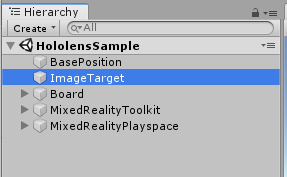
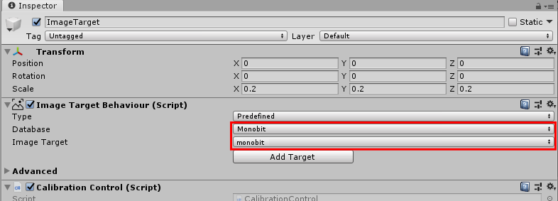
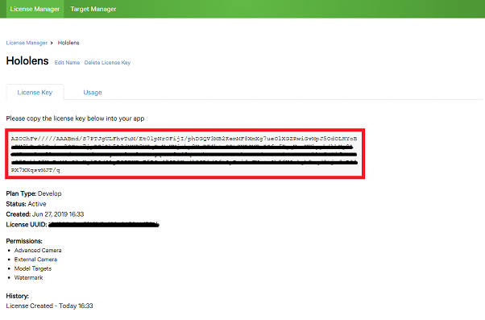
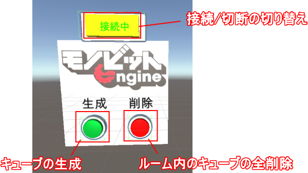

# HoloLens-sample
### 目次

<!-- START doctoc generated TOC please keep comment here to allow auto update -->
<!-- DON'T EDIT THIS SECTION, INSTEAD RE-RUN doctoc TO UPDATE -->

- [このデモは？](README.md#WhatIsAbout)
- [必要環境](README.md#Requirement)
- [環境構築](README.md#Equipment)
  - [Vuforia](README.md#Vuforia)
    - [VuforiaDeveloperAccountの登録](README.md#Vuforia_Register)
    - [ライセンスキーの作成](README.md#Vuforia_LicenseKey)
    - [認証画像のアップロード](README.md#Vuforia_MarkerUpload)
  - [Unity](README.md#Unity)
    - [プロジェクトのセットアップ](README.md#Unity_Clone)
    - [Vuforia認証画像のインポート](README.md#Unity_VuforiaMarkerImport)
    - [HololensSampleのシーン設定](README.md#Unity_HololensSampleConfiguration)
    - [HololensSampleのビルド設定](README.md#Unity_HololensSampleBuilding)
    - [VuforiaEngineライブラリ をプロジェクトに追加](README.md#Unity_MakeVuforiaDirectory)
    - [VuforiaConfigurationの設定](README.md#Unity_VuforiaConfiguration)
    - [モノビットエンジンクラウドへの接続設定](README.md#Unity_MonobitEngineCloud)
- [ビルドと実行](README.md#BuildAndRun)
- [HololensSampleの操作方法](README.md#Execute)

<!-- END doctoc generated TOC please keep comment here to allow auto update -->

<a name="WhatIsAbout"></a>
### このデモは？
- 弊社製「MUN」を使い、Microsoft社製HoloLensを利用したアプリケーションのサンプルデモです。<br>
  - MUNとは「Monobit Unity Networking」の略称で、Unity向けに作成されたマルチプレイ通信ライブラリです。<br>
　　http://www.monobitengine.com/mun/
  - 本デモでは「MUN」のVRボイスチャット拡張機能を実装した「VR Voice Chat with MUN」を使用しています。<br>
　　http://www.monobitengine.com/vrvc/
  - 本デモは、「VR Voice Chat with MUN 2.6.0」が導入済みの状態で頒布しております。

<a name="Requirement"></a>
### 必要環境
- Microsoft社製HoloLens, HoloLens2<br>
以下の手順で DevicePortal への登録処理と、デバイスのペアリングは済ませておいてください。<br>
　　https://docs.microsoft.com/ja-jp/windows/uwp/debug-test-perf/device-portal-hololens
- UnityEditor（Unity2019.1.0 以降のバージョン）<br>
あらかじめ UniversalWindowsPlatform（UWP）, VuforiaAugumentedReality の BuildSupportComponent をインストールしている必要があります。<br>
　　<br><br>
- WindowsSDK（10.0.18362.0 以降のバージョン）<br>
　　https://developer.microsoft.com/ja-jp/windows/downloads/windows-10-sdk
- VisualStudio2017<br>
　　https://visualstudio.microsoft.com/ja/vs/older-downloads/
<a name="MBECloudAuthentication"></a>
- モノビットエンジンクラウド接続環境<br>
　　https://web.cloud.monobitengine.com/<br>
　　こちらを参考に、モノビットエンジンクラウドのアカウント登録を済ませ、<br>
　　MUNバージョン2.7.0 用の「アプリケーションID」と「MUNリゾルバ一覧取得エンドポイント」を取得してください。<br>
　　<br><br>


<a name="Equipment"></a>
### 環境構築
<a name="Vuforia"></a>
#### Vuforia
本デモでは複数のHololens上で同一のAR空間を同期するために、VuforiaEngineを利用します。
<a name="Vuforia_Register"></a>
- VuforiaDeveloperAccountの登録<br>
　VuforiaEngineを利用するためにVuforiaDeveloperAccountの登録を行ないます。<br>
　　https://developer.vuforia.com/vui/auth/register<br>
　　<br><br>
<a name="Vuforia_LicenseKey"></a>
- ライセンスキーの作成<br>
　登録が完了したらLoginし、LicenseKeyを作成します。<br>
　　<br>
　　<br>
　　<br><br>
<a name="Vuforia_MarkerUpload"></a>
- Vuforia認証画像のアップロード<br>
　このライセンスキーで使用する、認識画像のアップロードを行ないます。<br>
　　<br>
　　<br>
　　<br>
<br>

<a name="Unity"></a>
#### Unity
<a name="Unity_Clone"></a>
- プロジェクトのセットアップ<br>
  - UnityEditor用のプロジェクトを https://github.com/MonobitInc/HoloLens-sample.git から clone して生成します。<br>
  - 生成したディレクトリを UnityEditor 上で開いてください。<br>
    途中で以下のポップアップが表示される場合、Apply を選択して Mixed Reality Toolkit XR Setting を有効にください。<br>
  　　<br><br>

<a name="Unity_VuforiaMarkerImport"></a>
- Vuforia認証画像のインポート<br>
  - 上記<a href="#Vuforia_MarkerUpload">認証画像のアップロード</a>で作成したターゲットから、認証画像データを含むパッケージをダウンロードします。<br>
　　<br>
　　<br>
　　<br><br>
  - ダウンロードしたパッケージを、UnityEditor上にインポートしてください。<br>
　　<br><br>
　　<br><br>

<a name="Unity_HololensSampleConfiguration"></a>
- HololensSampleのシーン設定<br>
  - UnityEditor上で Assets/Monobit Unity Networking/Samples/Scenes/HololensSample/HololensSample.unity のシーンを開きます。<br>
  - HololensSample シーンの Hierarchy から、ImageTarget のゲームオブジェクトを選択します。<br>
  <br>
  - ImageTarget の Inspector にある Image Target Behaviour について、上記<a href="Unity_VuforiaMarkerImport">Vuforia認証画像のインポート</a>でVuforiaからインポートした認証画像を選択します。<br>
  <br>

<a name="Unity_HololensSampleBuilding"></a>
- HololensSampleのビルド設定<br>
  - File -> Build Settings で Build Settings を開きます。<br>
  - Add Open Scenes のボタンを押し、HololensSample シーンを追加します。<br>
  <br><br>
  - Platformを Universal Windows Platform に切り替えます。<br>
  <br><br>
  - Player Settingsを開きます。<br>
  <br><br>
  - UWP の Publishing Settings を開きます。<br>
  <br><br>
  - Publishing Settings 内の Capabilities の項目内にある "InternetClient", "WebCam", "Microphone", "SpatialPerception" の４つの項目について、チェックボックスをONにします。<br>
  <br><br>
  - UWP の XR Settingsを開きます。<br>
  <br><br>
  - XR Settings 内の "Virtual Reality Supported", "Vuforia Augmented Reality Supported" のチェックボックスをONにします。<br>
  <br><br>

<a name="Unity_MakeVuforiaDirectory"></a>
  - VuforiaEngine ライブラリをプロジェクトに追加<br>
   - XR Setting にて "Vuforia Augmented Reality Supported" を有効にすることで、UnityEditorの GameObject -> Vuforia Engine から任意のゲームオブジェクトが生成できるようになります。その中から "AR Camera" を一時的に作成します。<br>
   <br><br>
   - 選択すると以下のようなポップアップウィンドウが表示されますので、Importを選択します。<br>
   <br><br>
   - しばらく待つとImportが完了し、Assets 下に Vuforia のディレクトリが作成されます。<br>
   <br><br>
   - Vuforia ディレクトリの作成を確認できたら、一時的に作成された "AR Camera" オブジェクトを削除します。<br>
   <br><br>

<a name="Unity_VuforiaConfiguration"></a>
  - VuforiaConfigurationの設定<br>
    - 上記<a href="#Vuforia_LicenseKey">ライセンスキーの作成</a>で作成したライセンスキーの詳細データを開きます。<br>
  　　<br><br>
  　　<br><br>
    - UnityEditor上で Assets/Resources/VuforiaConfigration.asset を選択し、Inspector 画面にて以下の項目を設定してください。<br>
      - Add License Key : 上記画面のライセンスキーをVuforiaのサイトからコピー＆ペーストして入力します。<br>
      - Digital Eyeware -> Device Type : Degital Eyeware を選択します。<br>
      - Digital Eyeware -> Device Config : Hololens を選択します。<br>
  　  <br><br>

<a name="Unity_MonobitEngineCloud"></a>
  - モノビットエンジンクラウドへの接続設定<br>
    - UnityEditor上で Assets/Monobit Unity Networking/Resources/MonobitServerSettings.asset を選択し、Inspector 画面にて　Server Settings の以下の項目を設定してください。<br>
      - Host Type : MBE Cloud を選択します。<br>
      - Protocol : TCP を選択します。<br>
      - Endpoint Address : 先に <a href="README.md#MBECloudAuthentication">モノビットエンジンクラウド接続環境</a>を構築する上でアカウント登録された情報のうち、「MUNリゾルバ一覧取得エンドポイント（http）」と書かれた項目をコピー＆ペーストして入力します。<br>
      - AppID : 先に <a href="README.md#MBECloudAuthentication">モノビットエンジンクラウド接続環境</a> を構築する上でアカウント登録された情報のうち、「アプリケーションID」と書かれた項目をコピー＆ペーストして入力します。<br>
  　　<br>

<a name="BuildAndRun"></a>
### ビルドと実行
- HololensSampleのビルド<br>
  - File -> Build Settings で Build Settings を開きます。<br>
  - UnityEditor の Build Settings 内にあるの build ボタンを押し、UWP用のVisualStudioプロジェクトを作成します。<br>
  <br><br>
  - VisualStudioを起動し、ビルドボタンで作成した UWP用のVisualStudioプロジェクトを開き、VisualStudioのビルド設定を"Release-x86-Device"を選択します。<br>
  <br><br>
  - Hololens をPCに接続し、起動した状態にしてから、VisualStudioのビルドを実行してください。<br>

<a name="Execute"></a>
### HololensSampleの操作方法
  - HololensSampleは以下の操作によって実行できます。<br>
```
キーボードの1 - キューブ生成
キーボードの2 - ルーム内のキューブ全削除
キーボードの3 - 接続/切断切り替え
マウスクリック - キューブの個別削除
```
  - また、Hololensの視線入力によって、以下のオブジェクトに視線を向けて決定ボタンを押しても同じ動作をします。<br>
    <br><br>
```
ルーム内パネルの「生成」ボタン - キューブ生成
ルーム内パネルの「削除」ボタン - ルーム内のキューブ全削除
ルーム内パネルの「接続中/接続切れ」ボタン - 接続/切断切り替え
ルーム内に生成されたキューブ - キューブの個別削除
```
